<br>
# Parent <br>
Description <br>
<br>
Author: skymen <br>
<sub>Made using [c3ide2-framework](https://github.com/ConstructFund/c3ide2-framework) </sub><br>

## Table of Contents
- [Usage](#usage)
- [Examples Files](#examples-files)
- [Properties](#properties)
- [Actions](#actions)
- [Conditions](#conditions)
- [Expressions](#expressions)
---
## Usage
To build the addon, run the following commands:

```
npm i
node ./build.js
```

To run the dev server, run

```
npm i
node ./dev.js
```

The build uses the pluginConfig file to generate everything else.
The main files you may want to look at would be instance.js and scriptInterface.js

## Examples Files

---
## Properties
| Property Name | Description
| --- | --- |
---

---
## Actions
| Action | Description |
| --- | --- |
| [Parent Layer](#parent-layer) | Parent to a layer |
| [Remove All Children](#remove-all-children) | Remove all children |
| [Remove Children From Layer](#remove-children-from-layer) | Remove children from a layer |
---
### Parent Layer
**Description:** <br> Parent to a layer </br>
#### Parameters:
| Name | Type | Description |
| --- | --- | --- |
| Layer | layer | The layer to parent to |
| Parent Sublayers | boolean | Whether to parent sublayers |
| X | boolean | Whether to parent X |
| Y | boolean | Whether to parent Y |
| Width | boolean | Whether to parent Width |
| Height | boolean | Whether to parent Height |
| Angle | boolean | Whether to parent Angle |
| Opacity | boolean | Whether to parent Opacity |
| Z Elevation | boolean | Whether to parent Z Elevation |
| Visibility | boolean | Whether to parent Visibility |
| Destroy with Parent | boolean | Whether to destroy with parent |
### Remove All Children
**Description:** <br> Remove all children </br>
### Remove Children From Layer
**Description:** <br> Remove children from a layer </br>
#### Parameters:
| Name | Type | Description |
| --- | --- | --- |
| Layer | layer | The layer to remove children from |
| Remove Sublayers | boolean | Whether to remove sublayers |

---
## Conditions
| Condition | Description |
| --- | --- |
---

---
## Expressions
| Expression | Description |
| --- | --- |
---